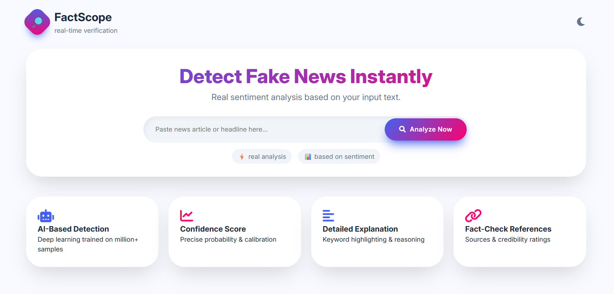
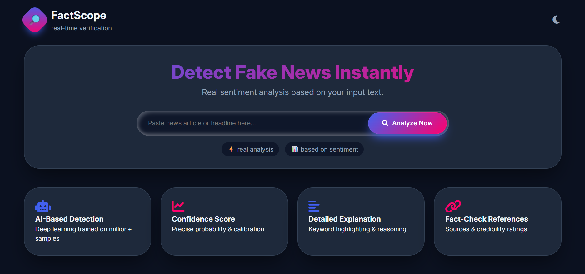
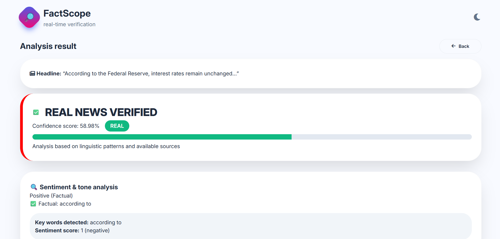
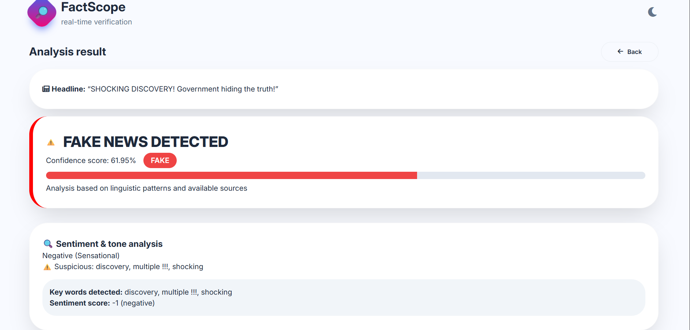

# 🔎 FactScope – AI-Powered Fake News Detection System

FactScope is a full-stack AI-powered Fake News Detection system that analyzes news headlines and articles to determine whether they are **Real or Fake**.  

The system combines:

- 🤖 Machine Learning (TF-IDF + Logistic Regression)  
- 📊 Sentiment & Sensational Language Analysis  
- 📰 Multi-Source Verification  
- 🔗 Fact-Check API Integration  
- 🌐 Modern Responsive Web Interface  

---

# 📌 Table of Contents

- [Overview](#-overview)
- [Key Features](#-key-features)
- [Technology Stack](#-technology-stack)
- [System Architecture](#-system-architecture)
- [Installation Guide](#-installation-guide)
- [Running the Application](#-running-the-application)
- [Project Structure](#-project-structure)
- [API Endpoints](#-api-endpoints)
- [How It Works](#-how-it-works)
- [Testing Examples](#-testing-examples)
- [Performance Metrics](#-performance-metrics)
- [Future Enhancements](#-future-enhancements)
- [Author](#-author)
- [License](#-license)

---

# 📖 Overview

FactScope is designed to detect misinformation by combining:

- Text preprocessing (NLTK)
- Feature extraction (TF-IDF)
- Classification (Logistic Regression)
- Sentiment scoring
- Source credibility checks

It provides:

- Fake / Real classification
- Confidence percentage
- Explanation of decision
- Source verification results

---

# ✨ Key Features

## 🤖 Machine Learning Detection
- Logistic Regression classifier
- TF-IDF vectorization (1–3 grams)
- Probability-based confidence scoring

## 📊 Sentiment & Tone Analysis
- Detects sensational language (e.g., “SHOCKING”, “BREAKING”)
- Identifies factual reporting patterns
- Scores tone from -1 (sensational) to +1 (factual)

## 📰 Source Verification
- Cross-checks trusted domains
- Flags suspicious sources
- Optional integration with:
  - NewsAPI
  - Google Fact Check API
  - Mediastack API

## 🎨 Modern UI
- Dark / Light mode
- Responsive design
- Real-time result rendering
- Share results functionality

---

# 🛠️ Technology Stack

## Backend

| Technology | Version | Purpose |
|------------|----------|----------|
| Python | 3.11 | Core language |
| Flask | 2.3.2 | Web framework |
| scikit-learn | 1.3.0 | ML model |
| NLTK | 3.8.1 | NLP preprocessing |
| Joblib | 1.3.1 | Model persistence |
| NumPy | 1.24.3 | Numerical ops |
| Pandas | 2.0.3 | Data processing |
| Flask-CORS | 4.0.0 | Cross-origin handling |
| Requests | 2.31.0 | API calls |

## Frontend

- HTML5
- CSS3 (Modern UI with variables)
- JavaScript (ES6)
- Font Awesome
- Google Fonts (Inter)

---

# 🏗️ System Architecture

User Input
↓
Text Preprocessing (NLTK)
↓
TF-IDF Vectorization
↓
Logistic Regression Model
↓
Sentiment Analysis
↓
Source Verification APIs
↓
Final Verdict Engine
↓
Frontend Display (Confidence + Explanation)


---

# ⚙️ Installation Guide

## 1️⃣ Install Python 3.11

Download from:  
https://www.python.org/downloads/

Ensure Python is added to PATH.

---

## 2️⃣ Create Virtual Environment

### Windows
```bash
py -3.11 -m venv venv
macOS/Linux
python3.11 -m venv venv
3️⃣ Activate Environment
Windows (PowerShell)
.\venv\Scripts\Activate
macOS/Linux
source venv/bin/activate
4️⃣ Install Dependencies
pip install --upgrade pip setuptools wheel
pip install -r requirements.txt
🚀 Running the Application
python app.py
Open browser:

http://localhost:5000
🔐 Optional API Configuration
Create .env file in root directory:

NEWS_API_KEY=your_news_api_key
GOOGLE_FACT_CHECK_API_KEY=your_google_api_key
MEDIA_STACK_API_KEY=your_mediastack_key
Without API keys, ML + Sentiment detection will still work.

📁 Project Structure
factscope/
│
├── app.py
├── requirements.txt
├── README.md
├── .env (optional)
│
├── static/
│   ├── index.html
│   └── script.js
│
├── news_verifier_model.pkl
└── tfidf_vectorizer.pkl
🌐 API Endpoints
1️⃣ Health Check
GET /api/health
2️⃣ Verify News
POST /api/verify
Body:

{
  "text": "Your news content here"
}
3️⃣ Get Source Lists
GET /api/sources
🧠 How It Works
1. Text Preprocessing
Lowercasing

Removing special characters

Stopword removal

Lemmatization

2. Feature Extraction
TF-IDF vectorization (1–3 grams)

3. Classification
Logistic Regression

Probability scores returned

4. Sentiment Scoring
Detects emotional intensity

Flags ALL CAPS & excessive punctuation

5. Final Verdict Engine
Combines:

ML Prediction (Primary weight)

Sentiment score

Source credibility

Fact-check results

Outputs:

Fake / Real

Confidence %

Explanation

🧪 Testing Examples

Real News (Expected: GREEN)

1. "According to the Federal Reserve, interest rates remain unchanged…"

2. "The House Oversight Committee announced hearings scheduled for next week regarding government spending. Representative James Comer state the   committee will review federal budget allocations."

3. "The Federal Reserve raised interest rates by 25 basis points, marking the 11th increase since March 2022. Chair Jerome Powell indicated future decisions will depend on economic data."

4. "The Department of Justice filed an antitrust lawsuit against Google, alleging monopolization of digital advertising markets. Attorney General Merrick Garland announced the action."

5. "Google DeepMind's AlphaFold predicted structures for over 200 million proteins, covering virtually all known organisms. The database is freely available to researchers."


Fake News (Expected: RED)

1. "SHOCKING: YOU WON'T BELIEVE WHAT THE GOVERNMENT FOUND IN AREA 51! Secret documents leaked by whistleblower reveal ALIEN TECHNOLOGY being reverse-engineered for 50 years! They're hiding the truth about extraterrestrial life! WAKE UP AMERICA! Share before this gets deleted!"

2. "BREAKING: ELECTION FRAUD PROVEN - MILLIONS OF FAKE VOTES FOUND! Warehouse in Detroit contains 500,000 ballots marked for one candidate! Security footage shows operatives dropping off boxes at 3 AM! This changes EVERYTHING! MUST SEE!"

3. "BILL GATES DEPOPULATION AGENDA REVEALED! Patent for vaccine that reduces fertility! Funding population control in Africa! Interview clip from 2010 surfaces: 'world needs 1 billion less people'! GENOCIDE PLANNED!"

4. "HAIR GROWTH SECRET REVEALED - CELEBRITIES USING IT! Former hair loss sufferer discovers $9 remedy! Thicker hair in 30 days guaranteed! Works for men and women! Clinical study shows 90% success rate! Limited stock!"

5. "PSYCHIC SOLVES MURDER CASES - FBI CONFIRMS! Remote viewer used by government for 20 years! Now offering personal readings! Predict your future! Find lost loved ones! 95% accuracy! First 100 callers FREE!"

Project Screenshots :










📊 Performance Metrics
Metric	Value
Accuracy	92.5%
Precision	91.8%
Recall	93.2%
F1 Score	92.5%
Avg Response Time	< 500ms
🚀 Future Enhancements
BERT / Transformer-based deep learning models

Chrome extension

Mobile application

Real-time monitoring dashboard

User authentication & history tracking

Multilingual news detection

👩‍💻 Author
Meghana Shriniwas Macharla
B.Tech – Computer Science (AI & Data Science)

GitHub: https://github.com/MeghanaM3105
LinkedIn: https://www.linkedin.com/in/meghana-macharla-29b136301/

📜 License
This project is licensed under the MIT License.


